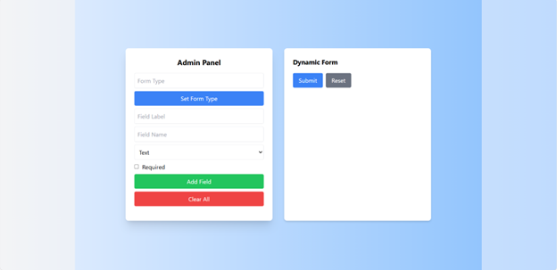

# Reusable Form Builder

## Overview
This project is a **Reusable Form Builder** built with **ReactJS** using **React Hook Form** for state management. It allows users to dynamically create and manage form fields, supporting various input types including text, email, number, password, date, dropdown, radio buttons, checkboxes, and file uploads. The project also features an **Admin Panel** for form customization.

## Features
- **Dynamic Form Creation**: Define form fields without hardcoding.
- **Admin Panel**: Easily add, edit, remove, and clear form fields.
- **Multiple Input Types**: Supports text, email, number, password, date, select, radio, checkbox, and file uploads.
- **Validation**: Required fields are enforced.
- **Form Submission**: Displays submitted data in JSON format.
- **Reset Functionality**: Clear all fields or reset the form.
- **Optimized Rendering**: Uses `React Hook Form` to prevent unnecessary re-renders.

## Tech Stack
- **ReactJS** (Component-based UI development)
- **React Hook Form** (Efficient form handling)
- **Tailwind CSS** (Styling and layout)
- **React Icons** (UI enhancements)
- **React Datepicker** (Date selection UI)

## Installation & Setup
### Prerequisites
Ensure you have **Node.js** and **npm** installed.

### Steps
1. Clone the repository:
   ```sh
   git clone https://github.com/yourusername/reusable-form-builder.git
   cd reusable-form-builder
   ```
2. Install dependencies:
   ```sh
   npm install
   ```
3. Start the development server:
   ```sh
   npm start
   ```
4. Open `http://localhost:3000` in your browser.

## Project Structure
```
├── src
│   ├── components
│   │   ├── FormBuilder.js  # Handles dynamic form rendering & validation
│   │   ├── AdminPanel.js   # UI for managing form fields
│   ├── App.js              # Main application entry point
│   ├── index.js            # React DOM rendering
│   ├── styles.css          # Styling (Tailwind)
│   ├── assets              # Static assets (if any)
│   ├── utils               # Utility functions (future expansion)
├── public
│   ├── index.html          # Main HTML template
├── package.json            # Dependencies & scripts
├── README.md               # Documentation
```

## Usage Guide
### Adding Fields
1. Use the **Admin Panel** to enter a **Field Label**, **Field Name**, and select a **Field Type**.
2. If the field type is **select** or **radio**, add **comma-separated options**.
3. For file uploads, specify **allowed extensions**.
4. Click **Add Field** to insert the field into the form.
5. Click **Clear All** to remove all fields.

### Editing & Removing Fields
- Click the **Edit (✏️)** button next to a field to update it.
- Click the **Delete (🗑️)** button to remove a specific field.

### Submitting the Form
- Fill in the form and click **Submit**.
- The submitted data appears in a JSON preview.
- Click **Reset** to clear the form.

## Adding New Features
### 1. **Adding a New Input Type**
- Modify `AdminPanel.js`:
  ```jsx
  <option value="newtype">New Input Type</option>
  ```
- Update `FormBuilder.js`:
  ```jsx
  {field.type === "newtype" && (
    <input type="newtype" {...register(field.name)} className="w-full border p-2" />
  )}
  ```

### 2. **Custom Validation**
- Add validation rules inside `FormBuilder.js`:
  ```jsx
  {errors[field.name] && <p className="text-red-500 text-xs">Custom error message</p>}
  ```

### 3. **Styling Enhancements**
- Modify `styles.css` or add Tailwind classes inside components.

## GitHub Repository Management
### Steps to Push to GitHub
1. Initialize Git (if not already initialized):
   ```sh
   git init
   ```
2. Add remote repository:
   ```sh
   git remote add origin https://github.com/yourusername/reusable-form-builder.git
   ```
3. Add and commit changes:
   ```sh
   git add .
   git commit -m "Initial commit"
   ```
4. Push to GitHub:
   ```sh
   git push -u origin main
   ```


## EXAMPLE OF USER REGISTIRATION



The above image showcases the Admin Panel and Dynamic Form of the Reusable Form Builder.

1. Admin Panel (Left Section)

**Allows users to configure dynamic forms by specifying:**

    --> Form Type: Defines the type of form being created.
    --> Field Label: Defines the display name of the field.
    --> Field Name: Unique identifier for the form field.
    --> Field Type: Dropdown to select different field types (Text, Number, Email, etc.).
    --> Required Checkbox: Marks the field as mandatory.
## Buttons:
    --> "Set Form Type" (Blue Button): Sets the form type.
    --> "Add Field" (Green Button): Adds a new field to the form.
    --> "Clear All" (Red Button): Removes all added fields.

2. Dynamic Form (Right Section)

    --> Displays the dynamically generated form based on the configurations set in the Admin Panel.
    --> Contains Submit and Reset buttons for form submission and resetting the form.

This feature allows users to create, modify, and manage dynamic forms without hardcoding fields, making the form builder reusable for various applications.


## Features
   ✅ Dynamic Form Fields – Supports text, email, number, password, date, dropdown, radio buttons, checkboxes, and file uploads.
   
   ✅ Admin Panel – Allows adding, editing, and deleting form fields with live updates.
   
   ✅ Validation Support – Fields can be marked as required.
   
   ✅ JSON Data Output – Captures and displays submitted form data in a structured JSON format.
   
   ✅ Date Picker & File Upload Support – Includes an interactive date picker and file upload functionality.

## Left Panel (Admin Panel):

  --> Users can dynamically add and remove fields.
  
  --> Field types include email, select, checkbox, radio, date, and more.
  
  --> Clicking "Add Field" updates the form dynamically.
  
## Right Panel (Generated Form):

  --> Shows the user-facing form based on the configured fields.
  
  --> Includes a date picker, radio buttons, and a file upload option.
  
  --> Displays the submitted form data in JSON format below the form.
  
## How to use
   1️⃣ Set up the form in the Admin Panel by adding fields dynamically.
   
   2️⃣ Fill out the generated form with user inputs.
   
   3️⃣ Submit the form to capture structured data.
   
   4️⃣ View the submitted data in JSON format at the bottom of the screen.


## User Registiration From Snapshots


